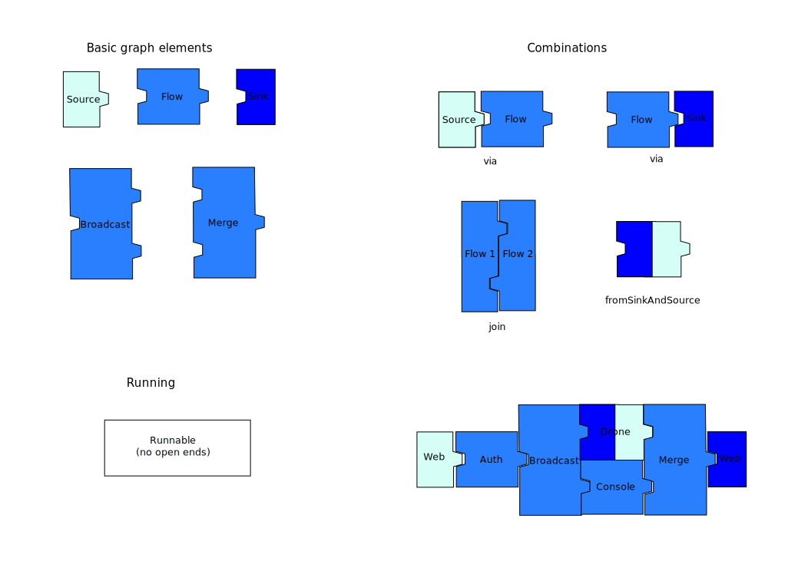

## Or,   Navigating a Drone with Scala

## Initial Idea

- Build a quadrotor
- From scratch
	- hardware
	- software
- Control with a joystick, no remote
- ⇒ Project Condor

## Two Parts

1. The Quadrotor
2. The Base Station

## System Overview

## 1. The Quadrotor

### *(the flying object)*   No Scala Here

Move on to the Scala parts →

See backstory
↓

### Frame

### Frame

### Electronics

### Flight Stack
- And then I found PX4, exactly what I was trying to build.

### Alternative: PX4
- Open Source Software
- Developed by Computer Vision and Geometry Group, ETHZ
- Uses open, wide-spread protocol MAVLink
- Runs on free RTOS [NuttX](http://nuttx.org/), available for AVR, ARM and more.

### Pixhawk Hardware
- Developed by the same group
- Expensive
- I already have a microcontroller and all sensors

### NuttX (beginning 2015)
- Our board uses the Teensy 3.1:
	- ARM Cortex M4
	- Freescale Kinetis K20 family

- NuttX (beginning 2015) has support for K40 family

### Let's port it!

- Subtle differences in processor families, K20 != K40
- I was never much involved with kernel development beforehand
- Debugging microcontrollers is no fun
	- (without JTAG or other fancy equipment)

### Fast-forward 2 months

### Get the Pixhawk and move on

## Quadrotor Take-Away:

- A lot of work has gone into existing hardware platforms
- ⇒ Use existing Pixhawk controller

## 2. The Base Station

- Control drone with joystick/gamepad
- Display live flight information
	- "virtual cockpit"

- Underlying process: *(proactive)* message streaming

## MAVLink Protocol

- Wide-spread use, including the PX4
- Published 2009 by Lorenz Meier, ETHZ
- Very simple and extensible

## MAVLink Frame

- Header-only structure
- Every entity on network has 2-byte address
- Low overhead: 6 bytes

~~~{.scala}
+-----+-----+-----+-------+--------+-------+---------+-----+
| Stx | Len | Seq | SysID | CompID | MsgID | Payload | CRC |
+-----+-----+-----+-------+--------+-------+---------+-----+
| 1   | 1   | 1   | 1     | 1      | 1     | n       | 2   |
+-----+-----+-----+-------+--------+-------+---------+-----+
~~~

## MAVLink Messages

- Message consists of:
	- ID/name
	- collection of fields (name, value) pairs

- Common message definitions in XML

- [Official repository](https://github.com/mavlink/mavlink) contains bindings for various languages

~~~{.xml}
<message id="0" name="HEARTBEAT">
	<description>Description...</description>
	<field type="uint8_t" name="type">...</field>
	<field type="uint8_t" name="autopilot">...</field>
	<field type="uint8_t" name="base_mode">...</field>
	<field type="uint32_t" name="custom_mode">...</field>
	<field type="uint8_t" name="system_status">...</field>
</message>
~~~

## MAVLink via the Base Station

- Send movement messages to drone:
    - standalone program
    - ⇒ [Maverick](https://github.com/project-condor/maverick)

- View and send non-movement messages:
	- ⇒ [Mavigator](https://github.com/project-condor/mavigator) (rest of this presentation)

## Mavigator

| Requirement | add Scala | Area
|-------------|-----------|-----|
| Modern, portable UI | Scala.js | frontend |
| Web server | Akka Http | backend |
| Message streaming | Akka Streams | backend |

## Live Demo

#### Alternatives
- online: <http://mavigator.jodersky.ch>
- run locally: `sbt mavigator-server/run`

## Frontend: Scala.js
- A JavaScript backend to the Scala compiler.
	- All the goodies from Scala: type safety, collections, etc
	- Outputs plain JavaScript
	- Can interface with plain JavaScript

- Developed at EPFL by Sebastien Doeraene
- Still in 0.x but totally usable!

## Frontend: Design
- One-page applications
- Static scaffolding with [Twirl](https://github.com/playframework/twirl) (Play! templates)
- Common launcher for all applications
- Extensible "cake" pattern:
	- Providing web page environment
	- Reading messages
	- Displaying instruments
	- Laying out elements

## Backend: Akka Streams
- Compatible with Reactive Streams
	- standard for aynchronous, non-blocking, back-pressures streaming
	- <http://www.reactive-streams.org/>
- "Natural" Streaming API

## Streams as Graphs

## Streams in Code

~~~{.scala}
//Simple source
val src: Source[Int, _] = Source.tick[Int](100millis, 100millis, 1)

//Nested source
val inc: Source[Int, _] = src.scan(0)(_+_)

//A discrete flow
val flow = Flow[Int].map(_*2)

//Simple sink
val sink = Sink.foreach(println)

//Print all even numbers, ad infinitum
(inc via flow to sink).run()

~~~

## More Streams

- Arbitrary graphs
- Feedback loops
- Materialization
- Much more...

<http://akka.io>

## Backend: Conceptual Model

## Backend: Actual Model

## Serial Backend

~~~~ {.scala}
Serial().watch(Set("/dev/ttyUSB0")).runForeach{ port =>

  //replace backend on connection
  val multiplexer: Flow[Bytes, Bytes, NotUsed] = setBackend()

  //open actual connection to drone
  val uav: Flow[Bytes, Bytes, NotUsed] =
    Serial().open(port, serialSettings)

  (uav join multiplexer).run()
}
~~~~

- `Serial()` is a custom Akka extension
- See <https://www.jodersky.ch/flow> for implementation

## Web Sockets

~~~~ {.scala}
path("/mavlink") {
  get {
    val fromWebSocket = Flow[Message].collect{
      case BinaryMessage.Strict(data) => data
    }

    val toWebSocket = Flow[Bytes].map{bytes =>
      BinaryMessage(bytes)
    }

    //request connection to multiplexer
    val backend: Flow[Bytes, Bytes, NotUsed] = Uav().connect()

    handleWebSocketMessages(fromWebSocket via backend via toWebSocket)
  }
}
~~~~
- Akka Route DSL
- Graph is run by Akka Http

## MAVLink CodeGen
- [sbt-mavlink](https://github.com/project-condor/sbt-mavlink):
    - generates data parser and assembler
	- message maps to case class

~~~{.scala}
case class Attitude(
  timeBootMs: Int,
  roll: Float, pitch: Float, yaw: Float,
  rollspeed: Float, pitchspeed: Float, yawspeed: Float)
    extends Message
~~~

## Demo: Do a Barrel Roll
- Define "unstable" message
- Add extra UI element to notify user
- Inject attitude messages

## Message

Add to dialect definition:

~~~{.xml}
<message id="150" name="STABILITY">
	<description>Stability issues</description>
	<field type="uint8_t" name="stable">Is it stable?</field>
</message>
~~~

## New UI element
- Danger indicator
- Illuminates on stability issues

## Barrel Roll: Injection

## Live Demo

#### Alternatives
- `git checkout demo1-before`
- `git checkout demo1-after`

## References

- Mavigator repository:

	<https://github.com/project-condor/mavigator>

- Project website:

	<https://project-condor.github.io>
